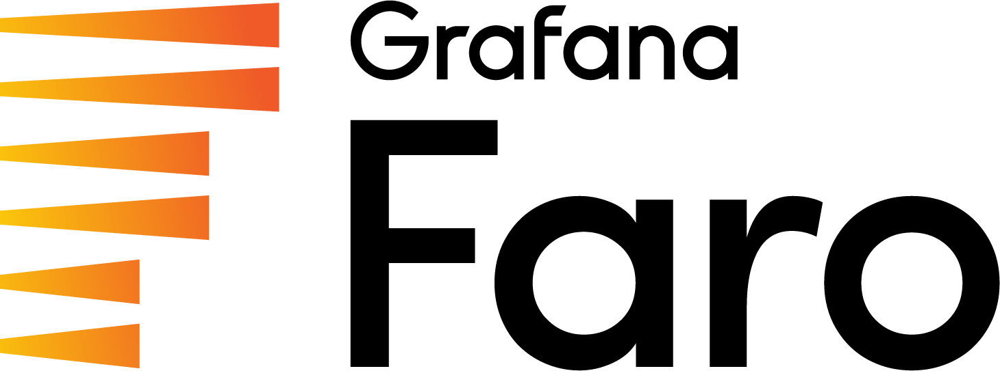

# Grafana Faro

<p align="left"></p>

## About
A project for frontend application observability, Grafana Faro includes a highly configurable web SDK for real user monitoring (RUM) that instruments browser frontend applications to capture observability signals. The frontend telemetry can then be correlated with backend and infrastructure data for seamless, full-stack observability.

For the Grafana Faro Web SDK, please go to [https://github.com/grafana/faro-web-sdk](https://github.com/grafana/faro-web-sdk).

The repository consists of 
- [OpenAPI specification](./spec/gen/faro.gen.yaml)
- Packages with HTTP Models generated from the OpenAPI specification

## Building

### With Docker (recommended)

No local dependencies required — Docker handles everything:

```sh
make build-all-docker
```

This builds a local image (`faro-build`) on first run, then regenerates all packages inside it.

### Locally

Install dependencies first:

```sh
# Python yq (not mikefarah/yq)
pip3 install yq

# oapi-codegen
make install-dependencies
```

Then build:

```sh
make build-all
```

## Requirements

- [Docker](https://docs.docker.com/get-docker/) (for `build-all-docker`)
- [Python YQ](https://pypi.org/project/yq/) (for local builds — note: this is the Python-based `yq`, not [mikefarah/yq](https://github.com/mikefarah/yq))
- [oapi-codegen v2.6.0](https://github.com/oapi-codegen/oapi-codegen) (for local builds)

## Packages

### Go

[/pkg/go](./pkg/go) contains HTTP Models in Go generated from the [OpenAPI specification](./spec/gen/faro.gen.yaml) using [oapi-codegen](https://github.com/oapi-codegen/oapi-codegen).

## Security

CodeQL static analysis runs on every push, pull request, and weekly. Findings are published to the repository [code scanning alerts](https://github.com/grafana/faro/security/code-scanning) page.
