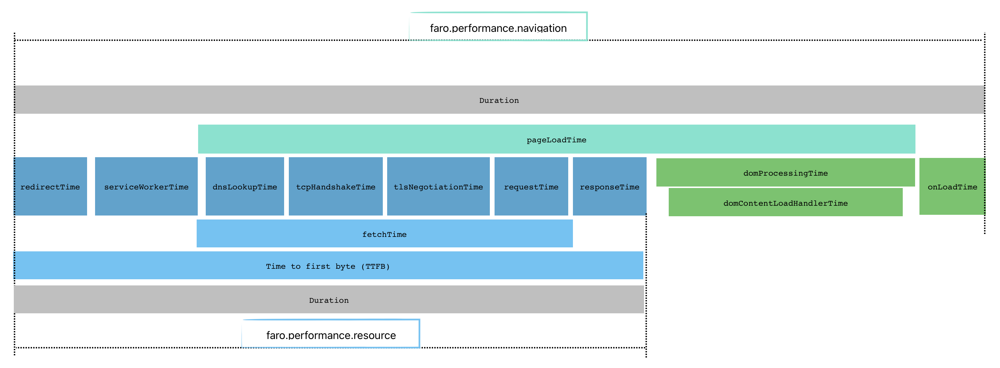

# Track Navigation and Resource performance

The Faro Web SDK Performance Instrumentation automatically instruments website navigation (page loading and rendering) and resource (JavaScript, CSS, images, and other files) performance to help you identify performance bottlenecks and make performance improvements.

## Getting started

Performance Instrumentation is enabled by default and can be disabled if it not needed.

To disable Performance Instrumentation set `enablePerformanceInstrumentation` to false when initializing Faro:

```ts
initializeFaro({
  url: "https://my-domain.my-tld/collect/{app-key}",
  app: {
    name: "my-app",
  },
  instrumentations: [
    ...getWebInstrumentations({
      enablePerformanceInstrumentation: false,
    }),
  ],
});
```

## Performance instrumentation explained

The Faro Web SDK uses browser APIs to retrieve detailed performance metrics and calculates, enriches, and sends custom metrics as `faro.performance.navigation` and `faro.performance.resource` events. Faro creates a unique ID per event, to map resources to navigation events and order navigation events in a session.

The [PerformanceNavigationTiming (MDN Web Docs)](https://developer.mozilla.org/en-US/docs/Web/API/PerformanceNavigationTiming) interfaces provides metrics on loading and rendering a single full document, for example opening a page, reloading a page, or following a link to another page.

The [PerformanceResourceTiming (MDN Web Docs)](https://developer.mozilla.org/en-US/docs/Web/API/PerformanceResourceTiming) interface provides detailed network data for loading resources, for example loading JavaScript, CSS, images, or fonts.



### Navigation event

The `faro.performance.navigation` contains all metrics from `faro.performance.resource` event and the following
metrics and properties:

**Metrics**

- `duration`: the full navigation time, `loadEventEnd - startTime`
- `pageLoadTime`: the time to load and render a page, `domComplete - fetchStart`
- `domProcessingTime`: the time to load and execute resources after `DOMContentLoaded`, `domComplete - domInteractive`
- `domContentLoadHandlerTime`: the time to execute delayed scripts after the `load` event, `loadEventEnd - loadEventStart`
- `ttfb`: the time from making the request to receiving the first byte from server, `responseStart - activationStart`

**Properties**

- `faroNavigationId`: unique ID for the navigation
- `faroPreviousNavigationId`: unique ID for the previous navigation, or `unknown`
- `type`: the navigation type, `back_forward,navigate,prerender,reload`
- `visibilityState`: the visibility of the page during the navigation

The `visibilityState` property can be useful to remove noise and get accurate results when filtering out hidden navigations, because browsers prioritize visible/foreground work and tabs loaded in the background are usually slower.

### Resource event

The `faro.performance.resource` event contains the following metrics and properties:

**Metrics**

- `duration`: the full resource load time, `responseEnd - startTime`
- `dnsLookupTime` the DNS lookup time, `domainLookupEnd - domainLookupStart`
- `tcpHandshakeTime`: the TCP handshake time, `connectEnd - connectStart`
- `tlsNegotiationTime`: the TLS negotiation time, `requestStart - secureConnectionStart`
- `redirectTime`: the time to follow all redirects, `redirectEnd - redirectStart`
- `requestTime`: the request time, `responseStart - requestStart`
- `fetchTime`: the time to fetch a resource without redirects, `responseEnd - fetchStart`
- `serviceWorkerTime`: the ServiceWorker processing time, `fetchStart - workerStart`

**Properties**

- `name`: the resource URL
- `initiatorType`: the element, not content type, that triggered the resource download
- `protocol`: the network protocol used to fetch the resource
- `decodedBodySize`: the size in octets of the message body after removing content encoding
- `encodedBodySize`: the size in octets of the payload body before removing any applied content encodings
- `cacheHitStatus`: the type of cache the resource was loaded from:
  - `cache`: direct cache hit
  - `conditionalFetch`: loaded via a 304
  - `fullLoad`: loaded from the server
- `renderBlockingStatus`: the render block status of a resource which has the `blocking="render"` attribute:
  - `blocking` the resource potentially blocks rendering
  - `non-blocking` the resource does not block rendering
  - `unknown`: the `renderBlockingStatus` property is **NOT** available in Firefox and Chrome
